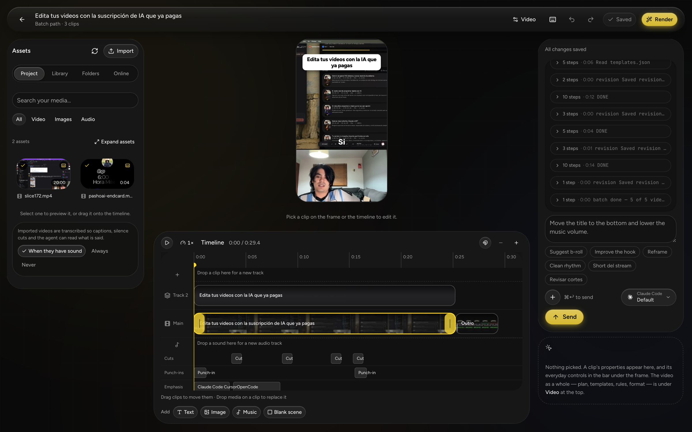
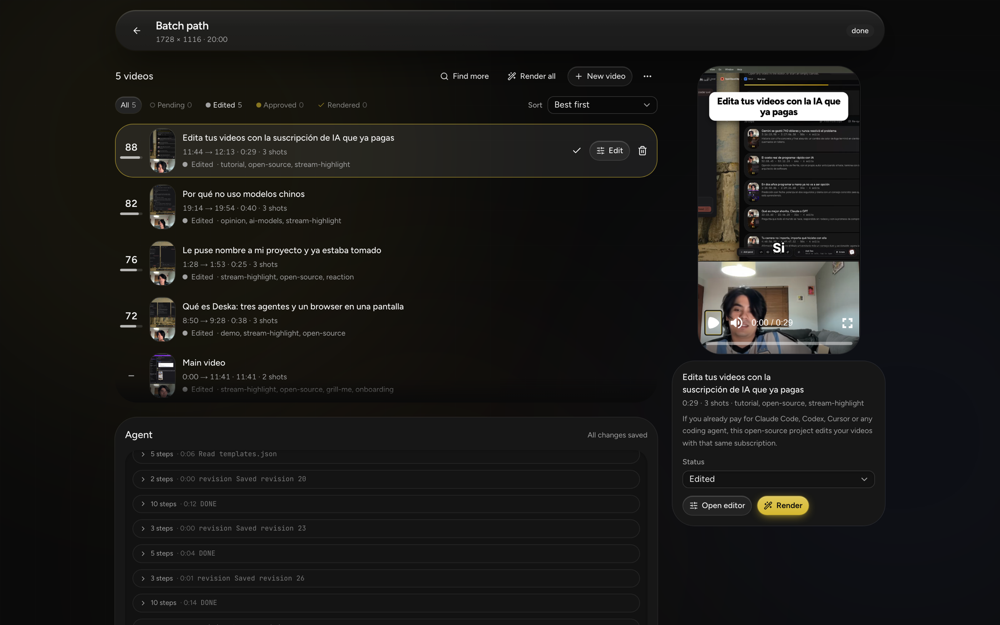
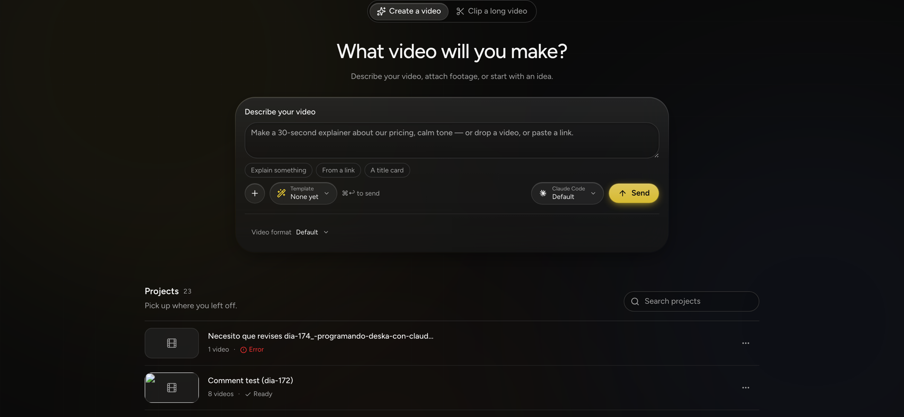

<p align="center">
  
</p>

<h1 align="center">agentcut</h1>

<p align="center"><strong>The coding agent you already pay for edits your videos.</strong></p>

You have Claude Code, Codex, Cursor or OpenCode. agentcut turns it into a video editor:
you describe the video in your terminal, the agent cuts, captions, scores and renders
it. When you want to change something yourself, open the browser editor. It is the same
project, live, with a timeline: fix what the agent did, or keep editing by hand.

No API keys, no account, no upload. Everything runs on your machine with the
subscription you already have.



## How it works

```
 you, in your terminal ──▶ your agent ──MCP──▶ agentcut ◀──browser── you, by hand
                                                  │
                                       one project, one timeline,
                                       one set of editing operations
                                                  │
                                               render
```

The agent and the browser call the same operations on the same saved project. What the
agent does shows up on your timeline within a second; what you drag is what the agent
reads next. Every clip, title and cut says who placed it, so you can always see why
something is there.

## Quick start

**1. Install.** Node.js 22.13+ and pnpm 11.9.0.

```sh
npm install --global pnpm@11.9.0
pnpm install --frozen-lockfile
```

**2. Give it to your agent.** Once, with the absolute path to this checkout:

```sh
claude mcp add agentcut -- node /absolute/path/to/scripts/agentcut.mjs mcp
codex  mcp add agentcut -- node /absolute/path/to/scripts/agentcut.mjs mcp
```

Cursor and OpenCode take the same command in their MCP config. No server needs to be
running.

**3. Ask.**

> Make a 40-second vertical short out of `~/recordings/stream.mp4` about the pricing
> part. Captions in my usual style, add the outro, render it.

**4. Open the editor when you want to look or touch something.**

```sh
pnpm dev --hostname 127.0.0.1    # http://localhost:3000
```

Full setup, configuration and troubleshooting: [docs/SETUP.md](docs/SETUP.md).

## What you can ask for

- **Clips from a long recording.** A stream, a podcast, a talk. The agent reads the
  transcript, the audio and sampled frames, picks the moments, and each one becomes an
  editable video with a score and a plan.
- **A video from footage.** Drop recordings, say what you want, get a cut with titles,
  captions, pictures and music.
- **A series.** Several recordings edited the same way, with one plan they all follow.
- **A change.** "Move the title down", "tighter cuts", "swap the outro". Edits apply
  directly, highlighted, undoable as one step.



## Make it yours

Four things shape every video the agent makes. All of them are files your agent, the
browser and the CLI read the same way.

- **Templates** are the structure of a finished video: where the hook goes, how
  captions look, how often a picture may interrupt, how the video ends. They also say
  what *kind* of video to make: a set of shorts, or one long section.
  [TEMPLATES.md](TEMPLATES.md)
- **Rules** say when to do what. "When the clip is gameplay, use this template and no
  pictures." A **glossary** keeps names spelled right in captions. **preferences.md**
  says how you like your videos, in your own words. [RULES.md](RULES.md)
- **Packs** are how all of that travels. A pack is a folder with templates, rules, the
  assets they need, a style guide (`STYLE.md`) and what a finished video must be true of,
  so a look can be checked, not only applied. Import one from a path or a URL; export
  yours to share it. [PACKS.md](PACKS.md), [REVIEW.md](REVIEW.md)
- **Your corrections.** Every time you fix something the agent placed, it is written
  down, and the agent reads that before its next run.

## The browser editor

A timeline with as many layers as you need: footage, titles, images, music, sound. Trim,
split, move, keyframe, add transitions, restyle captions. Pick a clip and ask the agent
about that clip right there. Nothing in it is a second implementation: every button
calls the same operation the agent calls. [docs/EDITING.md](docs/EDITING.md)



## Clipping needs two more tools

Editing and rendering need nothing else. Finding clips inside a recording also needs
`whisper-cli` for local transcription and an agent CLI installed and signed in;
`yt-dlp` only for URL imports.

```sh
brew install whisper.cpp yt-dlp
brew install --cask claude-code && claude    # sign in once, then exit
```

The first transcription downloads the Whisper model (about 1.6 GB). Clipping is the one
place agentcut launches an agent itself rather than being driven by yours; a picker
chooses which CLI and model. [HARNESS.md](HARNESS.md)

## Scripting

The same tools without MCP and without a server:

```sh
node scripts/agentcut.mjs projects create "Travel edit" one.mp4 two.mp4
node scripts/agentcut.mjs edit PROJECT_ID ask "Move the title to the bottom"
node scripts/agentcut.mjs render PROJECT_ID
node scripts/agentcut.mjs templates list
```

## Your data

Projects, media and renders live in `workspace/` inside this checkout. There is no
agentcut account and nothing is uploaded by agentcut. Agent runs send prompts,
transcripts and sampled frames to whichever provider your CLI is signed in to, under
that provider's terms. The server has no authentication and binds to loopback; it is
meant for your machine.

## More

- [Setup and troubleshooting](docs/SETUP.md) · [Editing by hand](docs/EDITING.md)
- [The shared editor and its tools](EDITOR.md) · [Sequences and the timeline](SEQUENCES.md)
- [Templates](TEMPLATES.md) · [Rules](RULES.md) · [Packs](PACKS.md) · [Review](REVIEW.md) · [Harnesses](HARNESS.md)
- [Direction and decisions](AGENT-FIRST.md) · [Requirements](SPEC.md) · [Design](DESIGN.md) · [Brand](BRAND.md)
- [Working on the code](AGENTS.md)

```sh
pnpm exec tsc --noEmit && pnpm test && pnpm test:render
```

Rendering uses [Remotion](https://www.remotion.dev/license): free for individuals and
companies of up to three people; larger companies need a licence. The project format
does not depend on it, so the renderer can be swapped.
