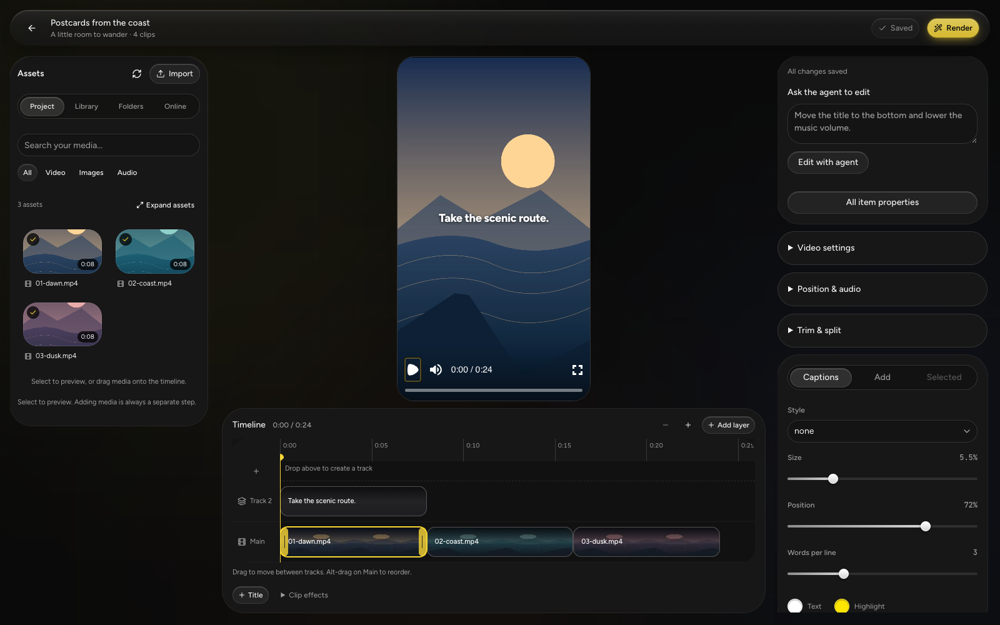

<p align="center">
  
</p>

<h1 align="center">agentcut</h1>

<p align="center"><strong>Edit and publish videos with your AI agent.</strong></p>

Describe the video you want. Your agent makes the cuts, adds captions, titles and
music, and prepares it for publishing. Open the visual editor whenever you want
to review or change something. You and your agent work on the same project.

agentcut is a local video harness: it gives your agent the tools to work on videos,
from the first edit to publication. It works with Claude Code, Codex, Cursor and
OpenCode, using the agent you already have installed and signed in.



## What you can do

- **Make a video.** Start with an idea, your footage, or an empty project.
- **Find clips.** Turn a stream, podcast or long recording into shorter videos.
- **Edit together.** Ask for changes in plain language or make them on the timeline.
- **Keep your style.** Reuse templates, save editing preferences and share them in packs.
- **Prepare and publish.** Review the video, write captions for each social account,
  and plan when to post it on a calendar.

Publishing supports Postgun, Postbridge and guided iPhone sessions. It is still
being tested: real posts through connected accounts and iPhone apps have not yet
been verified. See [publishing setup and status](PUBLISHING.md).

## Get started

You need Node.js 22.13+ and an installed, signed-in agent CLI.

```sh
git clone https://github.com/0xPasho/agentcut.git
cd agentcut
npm install --global pnpm@11.9.0
pnpm install --frozen-lockfile
pnpm dev --hostname 127.0.0.1
```

Open [localhost:7927](http://localhost:7927) and describe what you want to make.

> Make a 40-second clip about the pricing discussion. Add captions and my outro.

To find clips in recordings, you also need `whisper-cli` for transcription.
Importing videos from links needs `yt-dlp`. On macOS:

```sh
brew install whisper.cpp yt-dlp
```

The first transcription downloads a model of about 1.6 GB.
See the [setup guide](docs/SETUP.md) for more options and troubleshooting.

### Use your agent from the terminal

Connect agentcut through MCP, using the full path to your checkout. Run the command
for your agent:

```sh
claude mcp add agentcut -- node /absolute/path/to/agentcut/scripts/agentcut.mjs mcp
codex mcp add agentcut -- node /absolute/path/to/agentcut/scripts/agentcut.mjs mcp
```

Cursor and OpenCode use the same server command in their MCP settings. The browser
editor does not need to be running for your agent to work on a project.

## Your projects stay on your computer

Media, projects and exports are stored locally. Editing and rendering need no
agentcut account. Your agent sends prompts, transcripts and sampled frames to its
AI provider. Publishing connects to external accounts and uploads the videos you
choose to send.

## More

- [Editing](docs/EDITING.md) · [Publishing](PUBLISHING.md)
- [Templates](TEMPLATES.md) · [Rules](RULES.md) · [Packs](PACKS.md)
- [Agent support](HARNESS.md) · [How the shared editor works](EDITOR.md)
- [Project direction](AGENT-FIRST.md) · [Contributing](AGENTS.md)

Rendering uses [Remotion](https://www.remotion.dev/license), which has its own
licensing terms.
