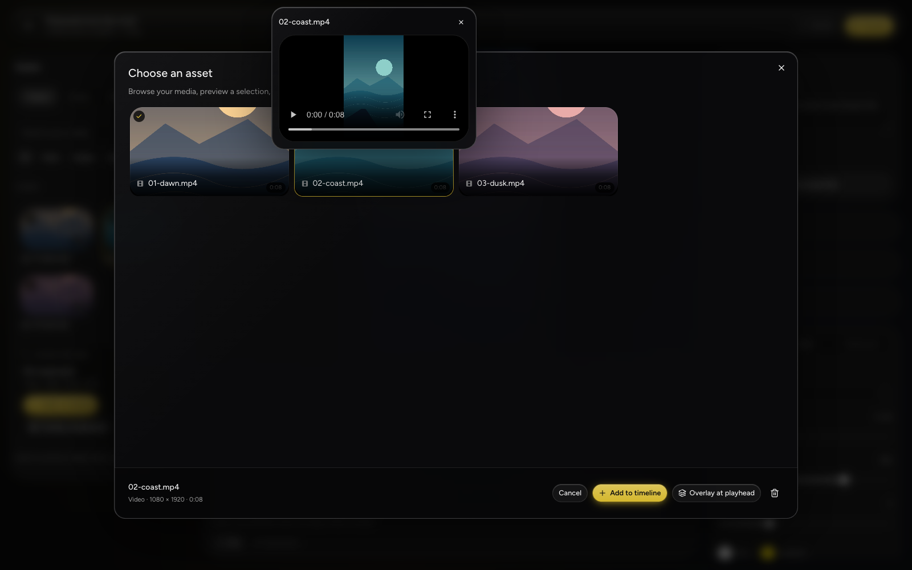

# Editing by hand

The browser UI is optional — everything here is also available to your agent
through the same operations (see [EDITOR.md](../EDITOR.md)). This page is for when
you want to do it yourself.

Start the app and open **http://localhost:3000**:

```sh
pnpm dev --hostname 127.0.0.1
```

## Build a video from scratch

1. Drop your videos into the box on the home screen, pick a shape, and send. You can start with an empty canvas.
2. Import videos or browse your local folders. The asset browser also exposes project
   media, reusable library assets, and online image sources.
3. Select an asset to preview it. Add it to the timeline, overlay it, or drag it onto a track.
4. Drag timeline blocks to move them in time or between tracks. Drag an edge to trim;
   hold near the viewport edge to scroll. Alt-drag onto Main reorders clips and closes gaps.
5. Add titles, images, or audio. Select a visual item to move or resize it on the canvas.
6. Edits autosave. Choose **Render**, wait for it to finish, then **Download** the MP4.

Rendering takes time and uses your machine's resources; changing an edit requires a
new render. The preview and export use the same composition implementation.

Use the back arrow to return to project information, create another output video, or
reopen an existing output. Adding footage to a generated clip continues that same edit
rather than creating a separate editor.



## Templates in the UI

Open **Video → Plan and templates** in the editor header, choose one, and press
**Preview plan**: it lists every sentence and marks the ones that would get a picture,
without changing anything. **Apply** commits it. Adjust the sliders and press **Apply**
again — re-applying replaces the template's own work and leaves anything you placed by
hand alone. **Save these settings as…** writes your own template into
`workspace/templates/`, alongside the built-in ones.

Applying a template to a clip the agent found promotes that clip in place, keeping its
link and its footage. See [TEMPLATES.md](../TEMPLATES.md).

## Captions and sources

**Re-sync captions** re-transcribes the source and refreshes the words on every clip
without touching your edits. The caption panel's **Sync** slider is for sources whose
own audio and video are offset.

## Reviewing what an agent did

Hovering a timeline item shows the rule, template or message that placed it. The plan
panel shows the decisions behind a video — change one and apply it again. Everything an
agent does is one history entry, so undo takes back the whole turn.
